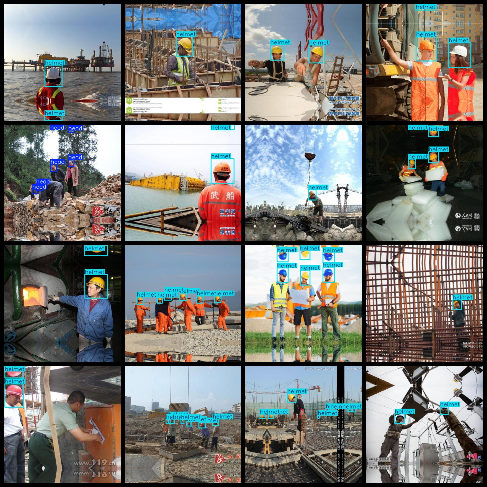
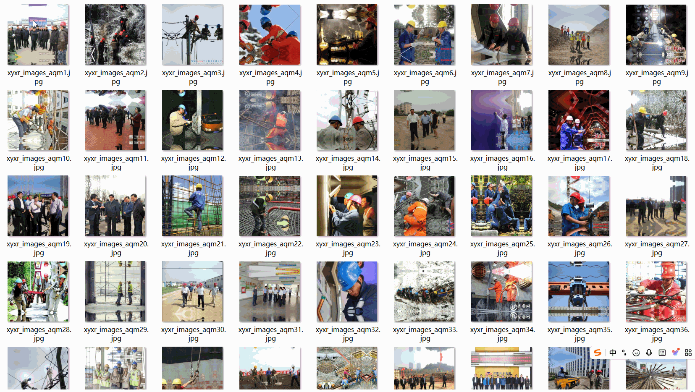

# Construction Plant Helmet Wearing Detection Dataset 5000 imagesVOC+YOLO format

Construction site helmet wearing test data set 5000 VOC + YOLO format

Dataset Format: VOC format + YOLO format

The compressed file contains: three folders, each storing images, xml files, and text files.

Total jpg images in JPEGImages folder: 5000

The total number of XML files in the Annotations folder is: 5000.

The total number of txt files in the labels folder is 5000.

Number of tag types: 3

Tag names: ["head","helmet","person"]

The number of boxes for each label (Note that the order of labels in the Yolo format does not correspond to this, but is based on the classes.txt file in the labels folder):

head frame count = 5785

helmet frame count = 18966

person frame count = 751

Total boxes: 25502

Picture clarity (Resolution: Pixels): Clear

Is the image enhanced: No

Shape of the label: Rectangular box, used for object detection and recognition.

Important Note: None

Special Notice: This dataset does not guarantee the accuracy or precision of the trained models or weight files. The dataset only provides accurate and reasonable annotations.

Annotation and image details are as follows:

## Images

---

Here is a pay link on Stripe (https://buy.stripe.com/3cs8yP7sY87d0vu9AB). Please contact me lonlonago@foxmail.com after funding $89, and I will send you a complete data files, thank you!

